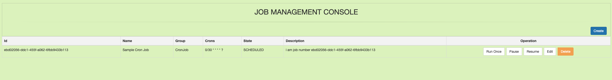

# Spring Boot Quartz

## Things to do list

1. Clone this repository: `git clone https://github.com/hendisantika/spring-boot-quartz.git`.
2. Go to its folder: `cd spring-boot-quartz`.
3. Run the application: `mvn clean spring-boot:run`.
4. Open your favorite browser: http://localhost:8081`
5. Open your favorite browser: http://localhost:8081/h2-console`

## Screen shot

Home Page

Create New Scheduler Job

